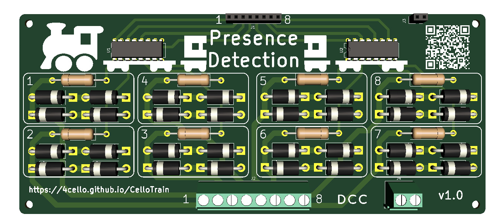

## Projects
### [Train Presence Detection](presence_detection/index.md)

A circuit board that monitors up to 8 track segments for current flow and outputs a signal for evaluation with an MCU (Arduino, ESP, Raspberry Pi  no MCU, i know...) or other components (LEDs, ...).

[Download links, schematics and explanations](presence_detection/index.md)

[//]: # (* TOC)
[//]: # ({:toc})