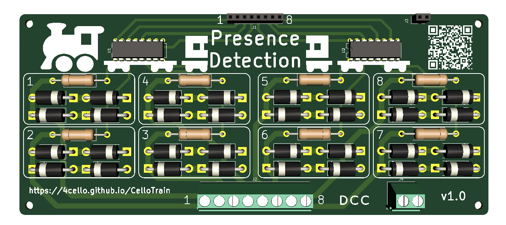

## Presence Detection
{:.no_toc}

A PCB that detects the presence of a train (or modified cart) in an isolated section of the track by detecting the flow of current. Inspired by [this youtube video](https://www.youtube.com/watch?v=XF1KzLbugPc) by ``N-Modellbahn`` (German language). 

Compatible with analog control as well as DCC (I don't know enough about other digital protocols to guarantee anything, but it should work).

* TOC
{:toc}

### Download
| Version | Link
---|---
v1.0 | [Release](https://github.com/4cello/CelloTrain/releases/tag/presence-v1.0)
### BOM
To fully assemble the PCB, the following components are required:

| Component | Qty | Usage | Comment |
---|---|---|---
Screw Terminal, 8pin, 5.08mm pitch | 1 | Connects to the track segments.
Screw Terminal, 2pin, 5.08mm pitch | 1 | Connects to the signal input. | Both pins are shorted so it doesn't matter which one you use.
Pin Header, 8pin, 2.54mm pitch | 1 | Used as logic output. | Male or female. Connected to the collectors of the optocouplers.
Pin Header, 2pin, 2.54mm pitch | 1 | Connected to the emitters of the optocouplers. | Male or female. Both pins are shorted, so technically 1pin would suffice.
4 channel optocoupler (DIP16) | 2 | Triggers when current is detected. Decouples track voltage from logic voltage. | I used LTV 844. Forward voltage needs to be >= 0.5 * diodes' forward voltage.
Rectifier Diodes, THT | 32 | Create voltage drops when current flows through them. | I used BY 550-50. Important characteristics: maximum current > 3A, maximum voltage > track voltage. Forward voltage: see optocouplers.
Resistor (10Ω), THT | 8 | I honestly don't know what those do, maybe limit current flow through optocoupler? I'm not an EE... | 
DIP16 Socket | 2 | If you don't feel comfortable soldering the optocouplers directly to the PCB or want to simplify replacements. | Optional

### Assembly
Assembly is straightforward. Make sure that the diodes and optocouplers are oriented as shown on the PCB's silk screen. If you're unsure about the optocoupler orientation, consult it's datasheet and make sure that the output side points to the upper edge of the PCB. Also, use DIP16 sockets in that case, so you can easily replace a fried optocoupler... 😉

### Installation

Isolate your track sections by disconnecting (at least) one of the rails. 
Connect the wire that serves that "side" of the track to the 2pin screw terminal on the bottom of the PCB, and connect the isolated rail of the section to the 8pin screw terminal.

The signal can now travel from your booster over the PCB to the track section. Since there is a voltage drop over the diodes, you may want to increase your supply voltage if necessary.

If you want to evaluate the presence detection with an MCU (Arduino, ESP, Raspberry Pi, ...), connect the MCU's GND to the 2pin header in the top right of the PCB, and connect GPIO pins to the 8pin header in the top center. If necessary, add a pull-up resistor for each pin.
When a track section is occupied, the corresponding pin is pulled to ground.

If you want to display the status of a section directly via an LED, connect V- to the 2pin header and the anodes of the LEDs to the 8pin header. Add a correct resistor to the LED and connect the cathode to V+. When a train is present in a section, the optocoupler allows current to flow, which makes the LED light up.

### Schematics

The schematic is split into hierarchical parts. The top level shows the board as basically comprised of two identical modules, connected to a set of in- and output contacts. Those two modules contains four sniffer modules, each of which is connected to a channel of a four channel optocoupler. The other pin of that channel connects directly to the DCC voltage.

The sniffer modules detect current by using two pairs of anti-parallel diodes to allow a DCC signal to propagate. If current flows across those diodes, a voltage drop occurs over the diodes, which triggers the optocoupler. This can be either detected by an MCU or used directly, e.g. to light up an LED.

### Changelog
* v1.0 (26.05.2021): Created initial design.